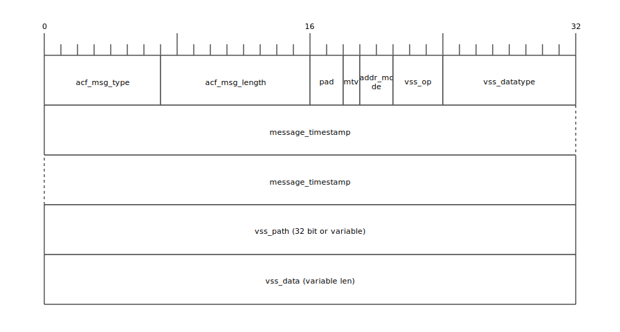
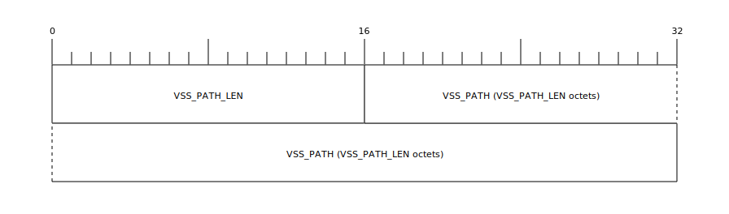
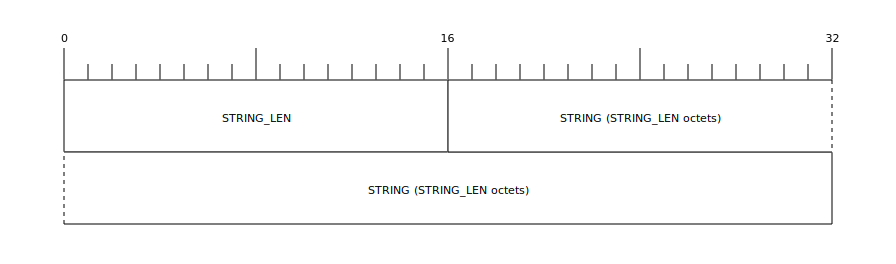
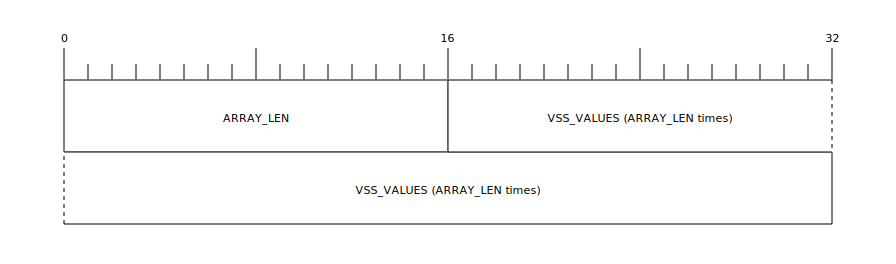

# ACF-VSS

Transport [COVESA Vehicle Signal Specification](https://covesa.github.io/vehicle_signal_specification/) (VSS) data over IEEE 1722.

## Overview

The VSS ACF message provides the capability to transport VSS data over a IEEE1722 stream. It is useful to connect the mechatronic layer or zones to a VSS based SDV system running on Vehicle Computers. I can also be used to introduce VSS semantics into the communication of deeply embedded ECUs in a resource friendly way.

## ACF Message Type

| Value            | Name          | Description          |
|------------------|---------------|----------------------|
| 42<sub>16</sub>  | ACF_VSS       | VSS data             |
| 43<sub>16</sub>  | ACF_VSS_BRIEF | Abbreviated VSS data |

## Frame format

The VSS ACF message inherits the following fields from the Common ACF message described in the IEEE 1722 standard

- acf_msg_type: 7 bits
- acf_msg_length: 9 bits

The VSS message defines the following message-specific fields

- **pad** (padding length): 2 bits
- **mtv** (message_timestamp valid): 1 bit
- **addr_mode** (address mode): 2bits
- **vss_op** (vss operation): 3 bits
- **vss_datatype**: 8 bit
- **message_timestamp**: 64 bit
- **vss_path**: 32 bits or variable
- **vss_data**: variable depending on vss_datatype

These fields are shown in the following table:



## pad (padding length) field: 2 bits

The pad field indicates the length of padding at the end of the message payload in octets. The Talker adds padding to the original data so that this message ends on a quadlet boundary. The Listener removes the padding when it parses the ACF message to obtain the original base message. A value of zero (0) in the pad field indicates that there is no padding in the ACF message payload.

## mtv (message_timestamp valid) field: 1 bit

The mtv field is used to indicate whether the message_timestamp field contains valid data. The bit is set to one (1) if the message_timestamp field contains a valid timestamp.
The bit is set to zero (0) if the message_timestamp field is not valid. An AVTP Listener ignores the message_timestamp in any message where mtv is set to zero (0).

## addr_mode (address mode) field: 2 bits

The address mode field defines how VSS paths will be addressed. Currently two values are defined:

| **addr_mode** | **Description**                                                                                                                                                                                                                                                                                                                                      |   |   |
|-----------|--------------------------------------------------------------------------------------------------------------------------------------------------------------------------------------------------------------------------------------------------------------------------------------------------------------------------------------------------|---|---|
| 00<sub>2</sub>       | interop_mode: VSS paths are identified via an UTF-8 string, as defined in the COVESA Vehicle Signal Specification, i.e. Vehicle.Speed While this is not the most efficient in terms of transmitted bytes and parsing overhead, it is the most compatible as any VSS system should be able to map this to any shorter IDs it might use internally |   |   |
| 01<sub>2</sub>        | staticid_mode: VSS paths are identified by a 32 bit static id as can be generated with the official COVESA vss-tools. While this is very efficient, there is no guarantee different VSS systems generate or assign static ids in the same manner.                                                                                                |   |   |
| 10<sub>2</sub>        | Reserved for future use                                                                                                                                                                                                                                                                                                                          |   |   |
| 11<sub>2</sub>        | Reserved for future use                                                                                                                                                                                                                                                                                                                          |   |   |

## vss_op (VSS operation) field:  – 3bit

The VSS operation field defines how the content of the VSS data section has to be interpreted.. Currently two values are defined:

| **vss_op**        | **Description**                                                                                                                       |
|---------------|-----------------------------------------------------------------------------------------------------------------------------------|
| 000<sub>2</sub>         | publish_currentvalue: The transferred data in VSS value is the current value of the VSS signal, i.e. the current vehicle speed    |
| 001<sub>2</sub>         | update_targetvalue: The transferred data in VSS value is the target value of the VSS signal, i.e. the intention to open the trunk |
| 010<sub>2</sub> - 111<sub>2</sub> | Reserved for future use                                                                                                           |

## vss_datatype field: 8bit

Denotes the datatype of the VSS value according to the defined primitive datatypes in COVESA VSS version 5. In VSS each signal can be defined as  a primitive datatype or an array of a primitive datatype. The first bit of the vss_datatype defines whether an array is used. The encoding of VSS struct datatypes is currently not defined.

This leads to the following valid values for vss_datatype:

| **vss_datatype**        | **COVESA VSS datatype** | **Description**                                               |
|---------------------|---------------------|-----------------------------------------------------------|
| 00000000<sub>2</sub>    / 0<sub>16</sub>  | uint8               | unsigned 8-bit integer                                    |
| 00000001<sub>2</sub>    / 1<sub>16</sub>  | int8                | signed 8-bit integer                                      |
| 00000010<sub>2</sub>    / 2<sub>16</sub>  | uint16              | unsigned 16-bit integer                                   |
| 00000011<sub>2</sub>    / 3<sub>16</sub>  | int16               | signed 16-bit integer                                     |
| 00000100<sub>2</sub>    / 4<sub>16</sub>  | uint32              | unsigned 32-bit integer                                   |
| 00000101<sub>2</sub>    / 5<sub>16</sub>  | int32               | signed 32-bit integer                                     |
| 00000110<sub>2</sub>    / 6<sub>16</sub>  | uint64              | unsigned 64-bit integer                                   |
| 00000111<sub>2</sub>    / 7<sub>16</sub>  | int64               | signed 64-bit integer                                     |
| 00001000<sub>2</sub>    / 8<sub>16</sub>  | boolean             | boolean value                                             |
| 00001001<sub>2</sub>    / 9<sub>16</sub>  | float               | IEEE 754-2008 binary32 floating point number              |
| 00001010<sub>2</sub>    / A<sub>16</sub>  | double              | IEEE 754-2008 binary64 floating point number              |
| 00001011<sub>2</sub>    / B<sub>16</sub>  | string              | an UTF-8 encoded string[N(1] [SS2] [SS3]                  |
| 10000000<sub>2</sub>    / 80<sub>16</sub> | uint8[]             | an array of unsigned 8-bit integers                       |
| 10000001<sub>2</sub>    / 81<sub>16</sub> | int8[]              | an array of signed 8-bit integers                         |
| 10000010<sub>2</sub>    / 82<sub>16</sub> | uint16[]            | an array of unsigned 16-bit integers                      |
| 10000011<sub>2</sub>    / 83<sub>16</sub> | int16[]             | an array of signed 16-bit integers                        |
| 10000100<sub>2</sub>    / 84<sub>16</sub> | uint32[]            | an array of unsigned 32-bit integers                      |
| 10000101<sub>2</sub>    / 85<sub>16</sub> | int32[]             | an array of signed 32-bit integers                        |
| 10000110<sub>2</sub>    / 86<sub>16</sub> | uint64[]            | an array of unsigned 64-bit integers                      |
| 10000111<sub>2</sub>    / 87<sub>16</sub> | int64[]             | an array of signed 64-bit integers                        |
| 10001000<sub>2</sub>    / 88<sub>16</sub> | boolean[]           | an array of boolean value                                 |
| 10001001<sub>2</sub>    / 89<sub>16</sub> | float[]             | an array of IEEE 754-2008 binary32 floating point numbers |
| 10001010<sub>2</sub>    / 8A<sub>16</sub> | double[]            | an array of IEEE 754-2008 binary64 floating point numbers |
| 10001011<sub>2</sub>    / 8B<sub>16</sub> | string[]            | an array of UTF-8 encoded strings                         |
| 8C<sub>16</sub>-FF<sub>16</sub>           | Reserved            | Reserved for future use                                   |

## message_timestamp field: 64 bits

The message_timestamp field contains the acquisition time in nanoseconds, if available, of the data contained in the  message.

The message_timestamp value is calculated from  the gPTP seconds and nanoseconds fields.

If the mtv bit is zero (0), then the content of the message_timestamp field is undefined and shall be ignored by
the listener.

## vss_path: 32 bits or variable
Addresses VSS signal. The content of this field depend on the setting of addr_mode.

When addr_mode=interop_mode this field contains the VSS path as UTF-8 string preceded by a two byte length field:



with

- VSS_PATH_LEN: The length the VSS_PATH in octets
- VSS_PATH: The VSS Path encoded as UTF-8 (not NULL terminated)

When addr_mode is  static_mode a VSS path is identified by a 32 bit identifier


## vss_data field: variable length

### Integer types
The content, length and format of vss_data depend on the the vss_datatype. The integer types `(u)int[8|16|32|64]` are represented in in big endian format.

### Float types

The float and double types are represented in 4 or 8 bytes in big endian format

### Boolean

Boolean values are represented in one octet, with 0 denoting “false” and 1 denoting true. All other values are considered invalid

### Strings

Strings are represented in  UTF-8 format preceded by a two bye length field. As there is an explicit length field, the string data is not null-terminated.



with

- String_len: The length of the encoded string in octets
- String_data: The string encoded as UTF-8

## Arrays
When arrays are transmitted (denoted by the first bit in vss-datatype being set to 1), the vss_data section starts with a two byte array_len field denoting the space in bytes the array occupies:



For example the vss_data section for  an array of uint16 values (vss_datatype=82<sub>16</sub>) from 0 to 5 would be encoded as the following hex sequence

```hex
00 0C 00 00 00 01 00 02 00 03 00 04 00 05
```

The vss_data section for  an array strings (vss_datatype=8B<sub>16</sub>) including "VSS", "❤️", "IEEE1722" would be encoded as the following hex sequence

```hex
00 17 00 03  56 53 53
00 06 E2 9D A4 EF B8 8F
00 08 49 45 45 45 31 37 32 32
```

## Dissectors
Wireshark dissectors to observe this protocol are available [here](./dissectors/). These dissectors can be simply copied into the folder for Lua dissectors of the Wireshark (e.g., ```~/.local/lib/wireshark/plugins``` in Ubuntu).